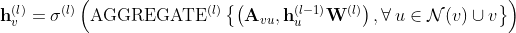
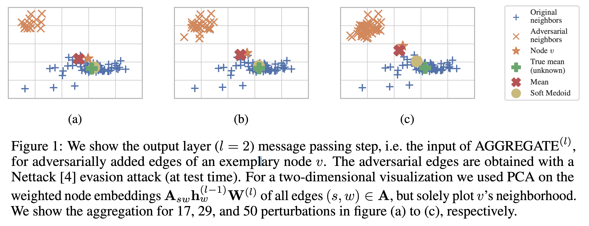
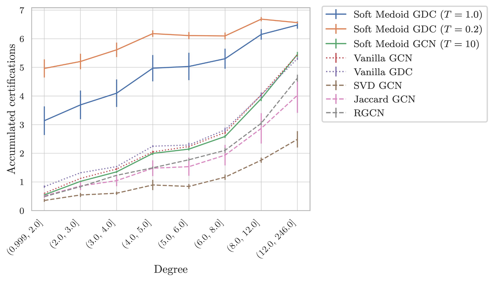

# Reliable Graph Neural Networks via Robust Aggregation


This repository contains the official implementation of:
> S. Geisler, D. Zügner, and S. Günnemann. Reliable Graph Neural Networks via Robust Aggregation. Neural Information Processing Systems, NeurIPS, 2020

See also: [Project Page](https://www.in.tum.de/daml/reliable-gnn-via-robust-aggregation/) - [Arxiv](http://arxiv.org/abs/2010.15651) - [Google Colab Notebook](https://colab.research.google.com/drive/1LLTQEjbAS6cnRoSbShomOIom5XH_NMVQ?usp=sharing)

## Paper Summary

The main idea is to substitute the message passing aggregation in a Graph Neural Network (GNN)



with robust location estimators for improved robustness w.r.t. adversarial modifications of the graph structure.

In Figure 1 of our paper, we give an exemplary plot for Nettack that clearly shows that strong adversarially added edges are resulting in a concentrated region of outliers. This is exactly the case where robust aggregations are particularity strong.


We show that in combination with personalized page rank (aka GDC - Graph Diffusion Convolution) our method (aka Soft Medoid GDC) outperforms all baselines and tested state of the art adversarial defenses:


Consider citing our work via:
```
@inproceedings{geisler2020robustaggregation,
  title =      {Reliable Graph Neural Networks via Robust Aggregation},
  author =     {Simon Geisler, Daniel Z{\"{u}}gner and Stephan G{\"{u}}nnemann},
  booktitle =  {Neural Information Processing Systems, {NeurIPS}},
  year =       {2020},
}
```

## TL;DR
Execute
```bash
conda install pytorch==1.6.0 torchvision torchaudio cudatoolkit=10.1 -c pytorch
pip install -r requirements.txt
pip install .

pip install ./kernels
conda install gmpy2 statsmodels
pip install ./sparse_smoothing
```
for setting the project up. Run for the results on empirical robustness (takes about 4 minutes with a GPU):
```bash
python script_evaluate_empirical_robustness.py
```
For the certified robustness via randomized smoothing use:
```bash
python script_evaluate_certified_robustness.py
```

## Requirements

For simplicity we recommend to install PyTorch a priori via anaconda:
```bash
conda install pytorch==1.6.0 torchvision torchaudio cudatoolkit=10.1 -c pytorch
```
We used Python 3.7.6 and CUDA 10.1. We provide custom CUDA kernels that are fairly simple implementations for a `row-wise topk` and `row-wise weighted median` on a sparse matrix.

Due to custom CUDA kernels, you must be able to compile via `nvcc`. Conda handles the c++ compiler etc. You also must have installed the CUDA toolkit and should select the matching CUDA version for your environment. Note that PyTorch Geometric and PyTorch have some version-dependent restriction regarding the supported CUDA versions. See also [Build PyTorch from source](https://pytorch.org/get-started/locally/#mac-from-source) which captures the requirements for building custom extensions. 

If you simply want to use the CPU, you can do not need to bothera bout CUDa and can go on with the installation. Later on you must add `--kwargs '{"device": "cpu"}'` while executing the `script_*.py` files.

Thereafter we can install the actual module via (alternatively use `python install .`):
```bash
pip install -r requirements.txt
pip install .
```
By default the requirements are installed with very restrictive versioning since we did not test any other configuration. If you have version conflicts, you can also build without version restrictions via omitting the command `pip install -r requirements.txt` (not tested).

### Prebuilt Kernels

In case you want to use the GPU, you also need to fulfill the [requirements for compiling a custom C++/CUDA extension for PyTorch](https://pytorch.org/tutorials/advanced/cpp_extension.html#using-your-extension) - usually satisfied by default voa the conda command above.

You can either build the kernels a priori with
```bash
pip install ./kernels
```
or PyTorch will try to compile the kernels at runtime.

### Sparse Smoothing

If you want to run the randomized smoothing experiments you need to install the respective module:
```bash
conda install gmpy2 statsmodels
pip install ./sparse_smoothing
```

In case the installation of `gmpy` fails please check out their [installation guide](https://gmpy2.readthedocs.io/en/latest/intro.html#installation).

## Unit Tests

To (unit) test the robust mean functions, you can run (make sure pytest is on your path):

```bash
    pytest tests
```

We also provde the reqwuirements we used during development via:
```bash
pip install -r requirements-dev.txt
```

## Training

**Note: you can skip this section as we provide pretrained models**

For the training and evaluation code we decided to provide SEML/Sacred experiments which make it very easy to run the same code from the command line or on your cluster.

The training for all the pretrained models is bundled in:
```bash
python script_train.py --kwargs '{"artifact_dir": "cache"}'
```

To train a model on `cora_ml` for evaluating the empirical robustness (from then on it will be also used for evaluation) e.g. run:
```bash
python experiment_train.py with "dataset=cora_ml" "seed=0" "model_params={\"label\": \"Soft Medoid GDC (T=1.0)\", \"model\": \"RGNN\", \"do_cache_adj_prep\": True, \"n_filters\": 64, \"dropout\": 0.5, \"mean\": \"soft_k_medoid\", \"mean_kwargs\": {\"k\": 64, \"temperature\": 1.0}, \"svd_params\": None, \"jaccard_params\": None, \"gdc_params\": {\"alpha\": 0.15, \"k\": 64}}" "artifact_dir=cache" "binary_attr=False"
```
With binary attributes (for randomized smoothing) use:
```bash
python experiment_train.py with "dataset=cora_ml" "seed=0" "model_params={\"label\": \"Soft Medoid GDC (T=1.0)\", \"model\": \"RGNN\", \"do_cache_adj_prep\": True, \"n_filters\": 64, \"dropout\": 0.5, \"mean\": \"soft_k_medoid\", \"mean_kwargs\": {\"k\": 64, \"temperature\": 1.0}, \"svd_params\": None, \"jaccard_params\": None, \"gdc_params\": {\"alpha\": 0.15, \"k\": 64}}" "artifact_dir=cache" "binary_attr=True"
```

## Evaluation

For evaluation, we execute all locally stored (pretrained) models.

### Empirical Robustness

Similarly to training, we provide a script that runs the attacks for different seeds for all pretrained models:
```bash
python script_evaluate_empirical_robustness.py
```

This will print the following table:
| dataset    | label                   | fgsm - 0.0    | fgsm - 0.1    | fgsm - 0.25   | pgd - 0.0     | pgd - 0.1     | pgd - 0.25    |
|:-----------|:------------------------|:--------------|:--------------|:--------------|:--------------|:--------------|:--------------|
| citeseer   | Jaccard GCN             | 0.714 ± 0.013 | 0.659 ± 0.010 | 0.600 ± 0.012 | 0.714 ± 0.013 | 0.658 ± 0.012 | 0.588 ± 0.014 |
| citeseer   | RGCN                    | 0.653 ± 0.030 | 0.595 ± 0.022 | 0.530 ± 0.020 | 0.653 ± 0.030 | 0.597 ± 0.029 | 0.527 ± 0.027 |
| citeseer   | SVD GCN                 | 0.650 ± 0.013 | 0.624 ± 0.014 | 0.563 ± 0.014 | 0.650 ± 0.013 | 0.618 ± 0.013 | 0.547 ± 0.014 |
| citeseer   | Soft Medoid GDC (T=0.2) | 0.705 ± 0.015 | 0.676 ± 0.017 | 0.650 ± 0.020 | 0.705 ± 0.015 | 0.677 ± 0.015 | 0.654 ± 0.020 |
| citeseer   | Soft Medoid GDC (T=0.5) | 0.711 ± 0.009 | 0.674 ± 0.012 | 0.629 ± 0.014 | 0.711 ± 0.009 | 0.673 ± 0.014 | 0.634 ± 0.016 |
| citeseer   | Soft Medoid GDC (T=1.0) | 0.716 ± 0.007 | 0.661 ± 0.010 | 0.606 ± 0.011 | 0.716 ± 0.007 | 0.658 ± 0.010 | 0.601 ± 0.013 |
| citeseer   | Vanilla GCN             | 0.712 ± 0.011 | 0.647 ± 0.008 | 0.567 ± 0.012 | 0.712 ± 0.011 | 0.639 ± 0.008 | 0.560 ± 0.011 |
| citeseer   | Vanilla GDC             | 0.709 ± 0.010 | 0.634 ± 0.007 | 0.556 ± 0.010 | 0.709 ± 0.010 | 0.625 ± 0.007 | 0.549 ± 0.010 |
| cora_ml    | Jaccard GCN             | 0.819 ± 0.007 | 0.735 ± 0.004 | 0.659 ± 0.002 | 0.819 ± 0.007 | 0.722 ± 0.006 | 0.623 ± 0.002 |
| cora_ml    | RGCN                    | 0.810 ± 0.004 | 0.720 ± 0.004 | 0.645 ± 0.004 | 0.810 ± 0.004 | 0.708 ± 0.003 | 0.612 ± 0.003 |
| cora_ml    | SVD GCN                 | 0.762 ± 0.015 | 0.729 ± 0.013 | 0.661 ± 0.009 | 0.762 ± 0.015 | 0.715 ± 0.015 | 0.630 ± 0.016 |
| cora_ml    | Soft Medoid GDC (T=0.2) | 0.801 ± 0.002 | 0.746 ± 0.002 | 0.697 ± 0.001 | 0.801 ± 0.002 | 0.753 ± 0.001 | 0.717 ± 0.001 |
| cora_ml    | Soft Medoid GDC (T=0.5) | 0.821 ± 0.002 | 0.751 ± 0.001 | 0.689 ± 0.003 | 0.821 ± 0.002 | 0.748 ± 0.001 | 0.687 ± 0.002 |
| cora_ml    | Soft Medoid GDC (T=1.0) | 0.829 ± 0.002 | 0.744 ± 0.002 | 0.681 ± 0.002 | 0.829 ± 0.002 | 0.738 ± 0.002 | 0.662 ± 0.001 |
| cora_ml    | Vanilla GCN             | 0.825 ± 0.012 | 0.730 ± 0.009 | 0.653 ± 0.004 | 0.825 ± 0.012 | 0.718 ± 0.008 | 0.617 ± 0.004 |
| cora_ml    | Vanilla GDC             | 0.833 ± 0.001 | 0.728 ± 0.005 | 0.653 ± 0.004 | 0.833 ± 0.001 | 0.715 ± 0.004 | 0.622 ± 0.005 |


### Certified Robustness

For `Cora ML` and `Citeseer` run
```bash
python script_evaluate_certified_robustness.py
```

This command results in:
| dataset   | label                   | Add & del. edges   | Add edges     | Del. edges    |
|:----------|:------------------------|:-------------------|:--------------|:--------------|
| citeseer  | Jaccard GCN             | 1.477 ± 0.094      | 0.134 ± 0.012 | 3.936 ± 0.160 |
| citeseer  | RGCN                    | 0.775 ± 0.096      | 0.037 ± 0.009 | 2.936 ± 0.231 |
| citeseer  | SVD GCN                 | 0.556 ± 0.110      | 0.001 ± 0.001 | 2.546 ± 0.082 |
| citeseer  | Soft Medoid GDC (T=0.2) | 4.809 ± 0.184      | 0.580 ± 0.025 | 4.429 ± 0.112 |
| citeseer  | Soft Medoid GDC (T=0.5) | 3.750 ± 0.211      | 0.437 ± 0.036 | 4.276 ± 0.118 |
| citeseer  | Soft Medoid GDC (T=1.0) | 2.694 ± 0.192      | 0.275 ± 0.026 | 4.170 ± 0.099 |
| citeseer  | Vanilla GCN             | 1.281 ± 0.097      | 0.113 ± 0.009 | 3.927 ± 0.167 |
| citeseer  | Vanilla GDC             | 1.152 ± 0.092      | 0.076 ± 0.006 | 3.901 ± 0.114 |
| cora_ml   | Jaccard GCN             | 1.912 ± 0.027      | 0.197 ± 0.007 | 4.462 ± 0.021 |
| cora_ml   | RGCN                    | 1.269 ± 0.089      | 0.099 ± 0.012 | 3.586 ± 0.161 |
| cora_ml   | SVD GCN                 | 0.918 ± 0.085      | 0.031 ± 0.030 | 2.795 ± 0.062 |
| cora_ml   | Soft Medoid GDC (T=0.2) | 5.977 ± 0.102      | 0.677 ± 0.011 | 4.795 ± 0.074 |
| cora_ml   | Soft Medoid GDC (T=0.5) | 5.688 ± 0.070      | 0.650 ± 0.007 | 4.830 ± 0.046 |
| cora_ml   | Soft Medoid GDC (T=1.0) | 4.947 ± 0.067      | 0.393 ± 0.180 | 4.857 ± 0.023 |
| cora_ml   | Vanilla GCN             | 1.848 ± 0.037      | 0.196 ± 0.007 | 4.425 ± 0.020 |
| cora_ml   | Vanilla GDC             | 2.003 ± 0.017      | 0.164 ± 0.005 | 4.457 ± 0.032 |

_Note that we use a different setup than in the paper. For example, here we updated to PyTorch 1.6.0 and use the most recent sparse smoothing code. This is the main reason why the numbers are slightly different than in our paper._

## Contributing

This code is licensed under MIT. In you want to contribute, feel free to open a pull request.
